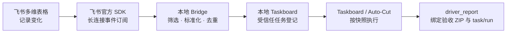

# 飞书 Bridge × Codex Taskboard

> 将飞书多维表格的状态变化，安全地转换为可追踪的 Taskboard 任务。

这是一个仅在本机运行的自动化桥接服务。它同时保留两条入口：旧版表级配置继续支持 `待剪辑` 的手动任务；新版由 Taskboard 登记的受信任学科 subject 使用固定三阶段状态，并通过版本化的受信任登记接口交给 Taskboard。Bridge 通过飞书官方 SDK 接收事件、校验状态边沿和整理受控上下文，不扫描本地目录来猜 ZIP，也不把飞书单元格当作路径、命令或 prompt。

分阶段登记只携带不具备执行权限的身份和来源证明：`event`、`binding`（`subjectKey`、`configVersion`、`stageId`）以及受控文档链接和命名字段结果。项目包、工作区、prompt、产物目录和上传目标由 Taskboard 的服务端配置快照决定。Taskboard/Auto-Cut 完成后通过 `driver_report` 准确绑定本次 task/run 的验收 ZIP；Bridge 不接收“最新 ZIP”猜测，也不负责实际视频剪辑。投递采用“至少一次处理 + 创建前元数据查找”，记录会持久化，临时故障可以有限重试并在重启后恢复；Bridge 不宣称绝对 exactly-once，因为当前 Taskboard 没有原生幂等键。Bridge 不会自动启动或停止 Codex，执行中的任务由使用者和所接入的 Taskboard 决定。

## 数据流



所有服务只监听 `127.0.0.1`；飞书单元格不能传入本地路径、命令或提示词。

## 当前已支持

| 能力 | 说明 |
| --- | --- |
| 飞书事件接收 | 使用飞书官方 Node SDK 的长连接接收多维表格记录变化。 |
| 安全路由 | 按 Base、表、字段、状态值和项目包别名筛选事件。 |
| 幂等去重 | 已持久化成功的同一 `event_id` 重放会返回 `duplicate`，正常重放不会再次创建；整体投递语义仍是至少一次。 |
| 任务标题回退 | 优先读取“视频名称”，其次“集合文档”，失败时回退到飞书记录 ID。 |
| Taskboard 集成 | 创建待办；记录离开 `待剪辑` 时只归档匹配的 `todo` 任务，不改动处理中或已完成任务；Bridge 不启动 Codex。 |
| 分阶段 Auto-Cut 登记 | 只接受 Taskboard 登记的 subject；同一状态字段按 `initial`、`first_review`、`final_review` 三个固定阶段路由，阶段关闭时不补执行，必须发生新的状态边沿才会登记。 |
| 受信任交接 | `/api/local/feishu/tasks` 接收 canonical `event`、`binding` 和 `controlledContext`；Taskboard 依据自己的 subject 快照派生项目包、执行模式、路径和 prompt。Bridge 不按文件名、mtime 或“最新 ZIP”猜任务归属。 |
| 受控素材上下文 | 只读取 subject 指定的文档字段和命名字段；文档链接经过 Feishu Docx 形式校验，命名唯一性没有证明时保持 `false` 并由 Taskboard 阻止自动执行。Bridge 不回写飞书记录。 |
| 配置版本快照 | 每次 subject 同步保存不可变 `configVersion`；重试使用事件、subject 和上下文快照，不重新解释当前配置。 |
| 可靠投递 | 投递状态持久化重试，临时 Taskboard 故障按有限退避处理，Bridge 重启后恢复未完成租约。 |
| 死信可见性 | 超过重试上限的事件进入 `dead_letter`，可从健康接口的队列计数定位。 |
| 状态文件保护 | 损坏的状态文件、无效租约或不完整快照会安全停留在可诊断状态；读写（包括健康队列统计）使用同一稳定路径校验和操作系统本机互斥锁，写入使用原子替换，崩溃后可安全恢复。状态文件必须是稳定的普通文件，不接受符号链接或硬链接别名。 |
| SDK-managed 监听 | 显式启用官方 SDK 自动重连；健康状态使用 `sdk_managed`，不伪造物理连接确认。 |
| 健康检查 | 一条命令检查 Node、配置、Taskboard、Bridge、监听器状态和 pending/retry/dead-letter 队列计数。 |

## 界面展示


上图为使用本地测试数据的真实 Taskboard 看板，展示了待办卡片及“等待认领”“处理中”“等你确认”等看板状态。Taskboard 的手动启动与网页展示属于外部 Taskboard 能力；本仓库的 Bridge 仅负责按规则创建待办任务。真实业务任务的可见范围仍应由团队权限和 GitHub 仓库权限控制。

## 本地配置详情

首次运行时，`start-local.ps1` 会从 `config/bridge.example.json` 生成被 Git 忽略的 `config/bridge.local.json`。示例文件包含占位符，不能直接用于真实飞书或模拟建任务；请先在本机填写测试 Base、表、字段 ID 和项目包配置。

- `tables` 只登记允许接收事件的 Base、表、触发字段、状态值和标题字段。
- `packages` 只登记受控的项目包别名，以及固定的 `projectId`、绝对 `workspacePath` 和提示词；飞书单元格只能选择别名，不能传路径、命令或提示词。
- `workflowFile` 保存 Taskboard 同步的 subject 目录和版本历史；未配置时默认为 `${stateFile}.workflow.json`。分阶段 subject 必须由 Taskboard 通过受保护的 workflow sync 接口登记，不能通过飞书描述、评论或单元格内容临时改变执行策略。
- 分阶段 subject 的每个阶段都独立保存启用开关、同一状态字段的 option ID、视频/修改意见来源、声音方式、产物目标目录和命名后缀。`video_original` 不需要音频来源；`replace_original` 必须显式配置音频来源。目录、上传目标等本地路径只在本机保存，workflow sync 响应会脱敏。
- Bridge 到 Taskboard 的专用接口使用本机共享密钥 `CODEX_FEISHU_BRIDGE_SECRET`。配置固定环境值时，`start-local.ps1` 会把同一个值注入 Taskboard 与 Bridge；未配置时，启动脚本会先按持久化 PID、启动时间和脚本身份验证并停止已存在的两端，对未标记实例还会核对脚本和 loopback 端口，再生成一次只存在于内存中的随机值并成对启动，避免单端重启后密钥不一致。无法验证进程身份时会拒绝停止和启动。Taskboard 启动 Codex 前会剔除该变量；密钥不会写入配置、运行时文件、任务描述或日志。
- 本地 Taskboard 是外部依赖，且需要它自己的依赖和可用的 Codex 可执行文件。启动脚本默认在 `D:\codex\dashi-taskboard` 查找它；若安装在别处，请在启动前设置 `$env:CODEX_TASKBOARD_ROOT` 为该目录的绝对路径。

不要提交 `config/bridge.local.json`、`.env.local` 或 `.runtime/`。默认示例工作区为 `examples/harmless-auto-cut`；确认测试流程稳定后，再将项目包的 `workspacePath` 和 `prompt` 调整为团队批准的真实值。

## 5 分钟快速体验（完成本地配置后）

### 1. 安装依赖并启动本地服务

```powershell
Set-Location D:\codex\codex-feishu
npm install
.\scripts\start-local.ps1
```

浏览器会打开 Taskboard：<http://127.0.0.1:47823>。

### 2. 检查运行状态

```powershell
.\scripts\check-local.ps1
```

### 3. 模拟一条进入“待剪辑”的记录

```powershell
.\scripts\simulate-ready.ps1
```

仅当 `config/bridge.local.json` 中的测试表和字段与 `simulate-ready.ps1` 的固定样例事件相匹配时，Taskboard 才会出现一张任务。已有成功状态后再次运行同一命令应返回 `duplicate: true`，正常情况下不会出现第二张任务；该脚本没有事件参数，请使用团队提供的匹配测试配置。其他表需要维护者提供并评审匹配的模拟请求，不要将示例占位符当作有效配置。

任务卡片标题按表配置读取当前记录：优先使用 `titleField`/`titleFieldId` 指定的 `视频名称`，为空时使用 `fallbackTitleField`/`fallbackTitleFieldId` 指定的 `集合文档`，两者都为空时回退到飞书记录 ID。标题读取失败不会阻止建任务，记录 ID 仍始终保留在任务描述中。

### 分阶段 Auto-Cut 交接

Taskboard 登记的学科 subject 只有一个单选状态字段，固定使用三个阶段 ID：`initial`（初稿）、`first_review`（初审修改）和 `final_review`（终审修改）。每个阶段可独立启用或关闭，但至少启用一个；只有状态从其他 option 变为该阶段配置的 option ID 时才登记，关闭期间不补执行。阶段之间移动时，Bridge 先归档旧阶段仍为 `todo` 的等待任务，再登记新阶段。缺少 before/after 任一侧或 option ID 不在已同步字段选项中时，Bridge fail-closed，不创建任务。

每个阶段的文档/附件素材来源、声音方式、产物目标目录和命名后缀都随 `configVersion` 固定。`video_original` 使用视频原音；`replace_original` 必须有外部音频来源。文档目录查找、附件下载以及数量和时长校验由 Taskboard/Auto-Cut 完成；Bridge 只转交 subject 指定的 Feishu Docx 链接和命名字段显示值，命名值没有唯一性证明时不会放行 automatic 执行。

Bridge → Taskboard 的受信任登记请求为 `POST /api/local/feishu/tasks`，请求头为 `x-taskboard-client: feishu-bridge` 和 `x-feishu-bridge-secret: <CODEX_FEISHU_BRIDGE_SECRET>`。请求体只有 `event`、`binding` 和 `controlledContext` 三部分：

```json
{
  "event": {
    "eventId": "evt_...",
    "baseToken": "bas_...",
    "tableId": "tbl_...",
    "recordId": "rec_...",
    "statusFieldId": "fld_...",
    "beforeOptionId": "opt_other",
    "afterOptionId": "opt_initial",
    "occurredAt": 1788652800000
  },
  "binding": {
    "subjectKey": "bas_...:tbl_...",
    "configVersion": 7,
    "stageId": "initial"
  },
  "controlledContext": {
    "documentLinks": ["https://example.feishu.cn/docx/xxxxxxxx"],
    "namingDisplayValue": "课程001",
    "namingValueUnique": true
  }
}
```

Taskboard 必须用 `subjectKey + configVersion + stageId` 验证任务归属，并从自己的快照派生项目包、工作区、prompt、执行模式、产物路径和上传策略。`automatic` 与 `enqueueMode=automatic` 的实际执行属于 Taskboard/Auto-Cut；Bridge 不启动 Codex、不剪辑视频、不上传文件，也不扫描目录或按文件名、mtime、“最新 ZIP”猜测产物。剪辑完成后由 Auto-Cut/Taskboard 通过 `driver_report` 将验收通过的 ZIP、哈希和对应 task/run 绑定，再进入上传队列。

Taskboard 读取受控上下文使用 `POST /api/feishu/workflow/controlled-context`，同步 subject 使用 `POST /api/feishu/workflow/sync`；两个接口都要求 `x-feishu-bridge-client: taskboard`、`x-feishu-bridge-secret`，并只接受 `127.0.0.1` 调用。同步响应不会返回本地/NAS 路径、workspace 或 prompt。普通任务、描述标记、伪造请求或没有有效 subject/version 的事件不具备分阶段自动登记资格；旧版 `tables` 的手动 `待剪辑` 流程保持不变。

### Windows 双击入口

仓库根目录提供了可以在资源管理器中直接双击的批处理文件，不需要先打开 PowerShell：

| 文件 | 用途 |
| --- | --- |
| `启动-Taskboard.bat` | 启动本地 Taskboard、Bridge 和飞书长连接，并打开 Taskboard 页面。 |
| `检查-Taskboard.bat` | 检查 Node.js、配置、Taskboard、Bridge、飞书长连接和队列状态。 |
| `停止-Taskboard.bat` | 停止本地 Taskboard 和 Bridge。 |

这些文件使用自身所在目录定位仓库，因此可以从资源管理器直接双击；它们仍复用 `scripts` 下的正式脚本，不会改变 `127.0.0.1` 监听边界。`启动-Taskboard.bat` 默认带 `-EnableFeishu`，会在打开页面前最多等待 30 秒，直到监听器进入 `sdk_managed`；启动脚本会在 `.runtime` 中记录并核对 PID、进程启动时间、启动器选中的精确 Node 可执行文件、精确脚本路径、健康接口和必要的 IPv4 loopback 监听端口；停止脚本会用同一 PID、启动时间、Node 可执行文件和脚本身份打开绑定的进程句柄后再终止，避免 Windows 重用旧 PID 时误停其他 Node 进程。旧版本留下的纯 PID 标记只有在启动脚本验证脚本、同一 Node 可执行文件、`127.0.0.1` 端口、接口健康和 Bridge 监听模式，并在写入身份文件前再次确认仍是同一进程实例后，才会自动升级；停止脚本不会用纯 PID 标记结束进程，而会提示先启动一次完成安全迁移。无法验证时会保留该进程并给出提示；停止脚本仍会检查另一个服务，随后以失败状态退出，使双击窗口停留显示原因。失败、超时或 Bridge 提前退出时，启动脚本只会清理已捕获精确创建时间的本次进程，并提示查看 `.runtime/logs/bridge.stderr.log`；检测到未标记的冲突 Bridge 时会提示先停止它。浏览器自动打开失败不会停止已经启动的服务。`检查-Taskboard.bat` 会要求监听器处于 `sdk_managed`。首次启动前仍需完成本地配置并安装 Node.js、Codex 和外部 Taskboard 依赖，不要把凭据写入批处理文件。

### 任务生命周期边界

- 其他值 → `待剪辑`：创建一张新的“等待认领”任务。
- `待剪辑` → 其他值：按任务描述中的 Base、表、记录和触发字段身份匹配，只归档仍为 `todo` 且未归档的任务。
- 已进入 `in_progress`（处理中）、`in_review`（等你确认）、`done` 或其他非 `todo` 状态：保持不动，由 Taskboard/Codex 管理。
- 再次进入 `待剪辑`：允许创建新任务；归档任务仍可在 Taskboard 的归档区域查看和恢复。

当前没有启用“飞书字段状态 → Taskboard 各列”的通用映射。已知并发边界是：如果离开事件延迟到快速“离开 → 再次进入”之后，旧事件按记录匹配全部 `todo` 任务，可能归档新一轮任务；需要严格按轮次隔离时，再增加记录版本或事件顺序约束。

建议用测试表按以下顺序验收：进入 `待剪辑` 确认出现等待认领任务；不接单改回其他状态确认任务消失且能在归档区查到；再次进入确认产生新任务；另一路先启动 Codex 再改飞书状态，确认执行中的任务不被归档。

## 团队交接与健康检查

完整的固定流程和变更规则见根目录 [`AGENTS.md`](./AGENTS.md)。在交给团队或排查问题时，先运行只读检查：

```powershell
.\scripts\check-local.ps1
```

它会检查 Node.js 版本、本地配置、Taskboard 和 Bridge 健康接口，并显示 `sdk_managed` 监听器状态及 pending、processing、retryWait、deadLetter 数量；不会停止进程、创建任务或打印凭据。需要确认真实飞书长连接时，再运行：

```powershell
.\scripts\check-local.ps1 -RequireFeishu
```

交接验收标准是：`npm test` 全部通过；模拟事件第一次只创建一个任务；已有成功状态的重放返回 `duplicate` 且不创建第二个任务；真实测试表记录改为 `待剪辑` 后能创建一个对应任务。整体链路是至少一次处理；若进程在 Taskboard POST 成功后、状态提交前崩溃，需依据任务元数据人工核对，不能宣称绝对 exactly-once。`-RequireFeishu` 只证明 SDK 已接管监听（`sdk_managed`），当前 SDK 没有公开的物理 socket 确认或连接回调，必须再用指定测试表事件做端到端验证。

### Taskboard 故障恢复演练

在指定测试配置下执行一次安全演练：

1. 暂停 Taskboard，调用现有 `simulate-ready.ps1` 发送一条匹配事件，确认接口返回 `202` 且队列出现 `retryWait`。
2. 恢复 Taskboard，等待退避窗口，确认队列计数归零，并通过事件元数据确认只保留一张任务。
3. 重放已有成功状态的同一事件，确认返回 `duplicate: true`，不会创建第二张任务。

只使用测试表和本地示例，不要通过删除状态文件来“修复”重复任务。

## 启用真实飞书长连接

Bridge 使用飞书官方 Node SDK `@larksuiteoapi/node-sdk@1.36.0`。第一次启用前安装依赖：

```powershell
Set-Location D:\codex\codex-feishu
npm install
```

`.env.local` 中需要有 `FEISHU_APP_ID` 和 `FEISHU_APP_SECRET`。该文件不会提交到 Git，启动日志也不会打印凭据。

随后启用长连接启动：

```powershell
.\scripts\start-local.ps1 -EnableFeishu
```

健康状态可从 <http://127.0.0.1:47824/health> 查看。监听器注册的事件为 `drive.file.bitable_record_changed_v1`，由官方 SDK 管理断线自动重连；收到事件后只按生命周期规则创建或归档手动待办，不会自动启动 Codex，也不会回写飞书记录。`sdk_managed` 表示 SDK 已接管生命周期，不代表应用拿到了公开的物理 socket 状态。

## 停止服务

```powershell
.\scripts\stop-local.ps1
```

这个脚本只停止它自己记录且命令行匹配的本地 Taskboard 与 Bridge 进程。

## 当前边界

- Bridge 已支持：模拟事件、真实事件标准化、官方 SDK 长连接入口、按表配置、字段 ID 匹配、任务标题字段回退、表级默认项目包、进入 `待剪辑` 时创建任务、离开 `待剪辑` 时归档未认领任务，以及幂等去重。
- Taskboard 的手动启动与网页展示属于外部 Taskboard 能力，不由 Bridge 实现或验证。
- Bridge 不会自动启动或停止 Codex；所有任务均需由使用者在所接入的 Taskboard 中手动处理。
- 不会回写飞书记录。
- 当前 SDK 没有公开的物理 socket 确认或连接生命周期回调；健康接口不会伪造 `connected` 状态。
- 暂无人工 `dead_letter` 重试 endpoint；需要人工处理时先依据队列计数和脱敏日志定位，并按评审流程操作。
- 不提供多实例高可用（HA）；补偿 worker 在单个 Bridge 进程内串行运行。
- 投递语义是至少一次；同机状态锁只封闭并发窗口。当前 Taskboard 没有原生幂等键，若 POST 已成功但 Bridge 在状态提交前崩溃，仍存在极端重复创建风险，需通过事件元数据核对。
- `stateFile` 必须保持稳定的普通文件路径；不支持状态文件本身的符号链接、硬链接或多链接别名，也不要在运行中替换状态文件路径。锁只覆盖本机 Windows/Linux 进程。
- Taskboard 返回无法识别的成功响应时会按临时故障重试；Bridge 的异常 HTTP 响应只返回安全错误码，不回显原始消息。
- 不处理真实视频，也不提供自动配音、自动剪辑或视频导出能力。
