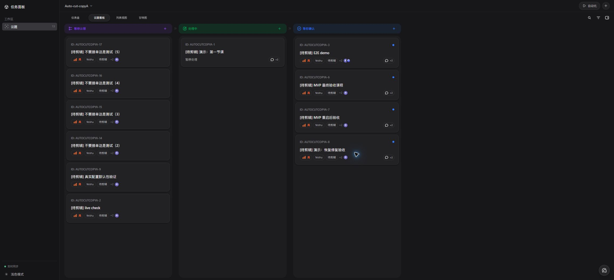

# 飞书 Bridge × Codex Taskboard

> 将飞书多维表格的状态变化，安全地转换为可追踪的 Taskboard 任务。

这是一个仅在本机运行的飞书工作流：飞书多维表格中的记录进入已配置的触发值或阶段后，本地 Bridge 通过飞书官方 SDK 接收事件、校验和整理数据，并在 Taskboard 创建受控任务；记录离开对应值或阶段时，只归档同一记录仍在“等待认领”（`todo`）的匹配任务。投递采用至少一次处理，记录会持久化，临时故障可以有限重试并在重启后恢复；Taskboard 的专用登记接口以非空 `event_id` 作为全局原子幂等键，精确重放返回已有任务，任何身份或受控上下文不一致都返回冲突。整体链路仍按至少一次语义运行，不宣称端到端 exactly-once。Bridge 不会自动启动 Codex，也不会停止 Codex；执行 Auto-Cut 的主体是 Taskboard，自动执行默认关闭。

## 数据流


所有服务只监听 `127.0.0.1`；飞书单元格不能传入本地路径、命令或提示词。

飞书任务的描述标记只用于展示和事件去重。真正允许启动 Auto-Cut 的任务来源会由 Taskboard 在本机专用接口中单独登记；普通任务即使复制描述标记和 `feishu` 标签，也不会获得执行资格。Bridge 与 Taskboard 需要同时使用支持该接口的版本；如果专用接口不可用，Bridge 会把事件保留在受控重试队列中，不会退回普通任务创建。自动执行还必须同时满足：`CODEX_TASKBOARD_ALLOW_AUTOMATIC_EXECUTION` 显式开启、任务具有可信来源登记、活动配置快照的执行模式为 `automatic`、项目包别名存在于本机启用白名单。自动触发只由服务端在可信登记流程中生成；通用执行接口仅接受手动点击或拖拽触发，不能由请求体声明 `automatic`。可信自动任务只有在执行预约持久化后才确认登记成功；若任务创建与预约之间中断，同一事件的幂等重放会补齐预约。Taskboard 会在延迟唤醒、排队取得资源和重启恢复时重新核对当前任务的来源登记、描述标记、`feishu` 标签、执行模式与投递来源；资格被撤销时会取消预约，不能继续自动启动。模拟事件始终是测试来源，不获得自动执行资格；升级前未持久化来源的非终态队列记录也会保守降级为模拟来源，只能手动执行。同一非终态事件重新领取时，已存事件、冻结决策和本次重放中的来源证据只会向更保守的模拟来源合并，不能把模拟来源重新升级为真实飞书来源。

每个 Base/子表的 Taskboard 隔离项目 ID 固定为 `feishu-` 加上 `sha256(baseToken:tableId)` 的前 16 个十六进制字符；Bridge 和 Taskboard 必须保持这一规则一致。旧项目 ID 不会自动改写，新投递统一使用 16 位规则。

## 当前已支持

| 能力 | 说明 |
| --- | --- |
| 飞书事件接收 | 使用飞书官方 Node SDK 的长连接接收多维表格记录变化。 |
| 安全路由 | 按 Base、表、字段、状态值和项目包别名筛选事件。 |
| 幂等去重 | 已持久化成功的同一 `event_id` 重放会返回 `duplicate`，正常重放不会再次创建；整体投递语义仍是至少一次。 |
| 任务标题回退 | 优先读取“视频名称”，其次“集合文档”，失败时回退到飞书记录 ID。 |
| Taskboard 集成 | 通过本机 Bridge 专用来源登记接口创建待办；记录离开可开始值时只归档匹配的 `todo` 任务，不改动处理中或已完成任务；Bridge 不启动 Codex。Taskboard 自动执行策略默认关闭。 |
| 三阶段工作流 | Taskboard 管理的活动配置可分别启用 `initial`、`first_review`、`final_review`；Bridge 只在记录从其他 option 进入已启用阶段 option 时登记该阶段任务。 |
| Auto-Cut 与产物 | Taskboard 负责统一执行入口、并发控制、Auto-Cut 调用、剪映草稿/ZIP 校验以及本地或 NAS 上传；这些能力不在 Bridge 进程中执行。 |
| 可靠投递 | 投递状态持久化重试，临时 Taskboard 故障按有限退避处理，Bridge 重启后恢复未完成租约。 |
| 死信可见性 | 超过重试上限的事件进入 `dead_letter`，可从健康接口的队列计数定位。 |
| 状态文件保护 | 损坏的状态文件、无效租约或不完整快照会安全停留在可诊断状态；读写（包括健康队列统计）使用同一稳定路径校验和操作系统本机互斥锁，写入使用原子替换，崩溃后可安全恢复。状态文件必须是稳定的普通文件，不接受符号链接或硬链接别名。 |
| Base 元数据预览 | `POST /api/feishu/base-preview` 只接受携带 `x-feishu-bridge-client: taskboard` 和本机共享密钥的 Taskboard 请求；在本机配置飞书凭据后，它仅执行只读 metadata 操作，按 Base 链接读取 Base、子表、字段和单选项元数据。即使长连接监听关闭，预览仍可使用，且不会启用子表或接收事件。 |
| 工作流共享配置 | `GET /api/feishu/workflow/share/export` 导出脱敏配置；`POST /api/feishu/workflow/share/import` 的 `dryRun` 会在不写入配置的前提下校验实时 Base/子表/字段，并报告本机缺失的包别名、工作区、ZIP 获取和上传路径绑定。Taskboard 调用 Bridge 检查时只发送 Bridge schema 明确允许的字段，不传 Taskboard 专用项目 ID 或缓存 metadata。实时校验要求 Base/子表名称一致、状态字段为唯一的单选字段，并拒绝重复字段/选项 ID 和互相冲突的字段类型。导入只创建草稿，不自动启用子表；共享内容和诊断不会回显绝对路径、来源 URL、凭据或 SDK 原始错误。 |
| SDK-managed 监听 | 显式启用官方 SDK 自动重连；健康状态使用 `sdk_managed`，不伪造物理连接确认。 |
| 健康检查 | 一条命令检查 Node、配置、Taskboard、Bridge、监听器状态和 pending/retry/dead-letter 队列计数。 |

## 界面展示



上图为使用本地测试数据的真实 Taskboard 看板，展示了待办卡片及“等待认领”“处理中”“等你确认”等看板状态。本仓库内置的 Taskboard 负责界面、人工操作和受控 Auto-Cut 执行；Bridge 只负责事件接收、规则判断和任务登记/归档。真实业务任务的可见范围仍应由团队权限和 GitHub 仓库权限控制。

## 本地配置详情

首次运行时，`start-local.ps1` 会从 `config/bridge.example.json` 生成被 Git 忽略的 `config/bridge.local.json`，并从 `config/autocut-packages.example.json` 生成独立的 `config/taskboard-feishu-packages.json`。两个文件只在目标不存在时创建，不会覆盖已有配置。示例文件包含占位符，不能直接用于真实飞书或模拟建任务；请先在本机填写测试 Base、表、字段 ID，并在 Auto-Cut 包 registry 中配置包。

### 学科的自动 / 手动剪辑开关

在 Taskboard 的飞书工作流配置中选中学科，打开三阶段配置上方的 **通用执行设置 → 剪辑模式**，选择“自动”或“手动”。每个学科只有一个剪辑模式，初稿、初审修改、终审修改共用；并发组、并发数和资源组也在这里设置。

读取或刷新 Base 元数据时首次发现的学科（例如新建的“高中历史副本”子表）默认生成“自动”草稿，补齐字段、Auto-Cut 包和阶段目录等必要设置后，仍须 **保存草稿 → 启用** 才会生效。现有学科都显示这个开关，并保留原来的自动或手动值；刷新、移除后恢复不会批量改为自动。历史配置修复及共享配置导入缺少执行模式时，继续保守使用手动。

通用执行设置显示本机自动执行总开关的实际状态（已开启 / 已关闭 / 状态未知），该状态只读。总开关仍由部署环境的 `CODEX_TASKBOARD_ALLOW_AUTOMATIC_EXECUTION` 显式开启，默认关闭；学科选择“自动”不会改变它。新任务还必须满足可信 Bridge 登记、已启用活动配置和本机启用包白名单等条件，模拟来源不能自动执行。保存草稿期间原活动配置继续有效，点击启用后由新配置处理后续触发；已有任务的模式和运行状态不会追溯修改，也不会自动重跑。ZIP 与上传中的“上传入队”仍单独控制。

- 旧版 `tables` 配置只登记允许接收事件的 Base、表、触发字段、单一可开始值和标题字段。Taskboard 管理的新工作流则保存活动 subject 快照，并分别配置 `initial`、`first_review`、`final_review` 三个阶段；两种配置都不启用飞书状态到 Taskboard 各流程列的通用映射。
- 每个新导入的子表都会按自己的 `baseToken:tableId` 和当前字段/选项 metadata 创建完整的 phased 草稿，包含字段来源、初稿、初审修改、终审修改、Auto-Cut 路由及 ZIP/上传设置；不同子表不会共享字段或选项绑定。已有 legacy subject 刷新时只补齐缺失的 phased 结构，并保留原有触发、执行、包路由、上传、显示和本机路径设置；已停用的 legacy subject 仍保持停用，只有已启用 subject 才会因元数据刷新降为草稿。
- 刷新 Base 元数据会把已启用学科降为待确认草稿，但不会覆盖用户尚未保存的音频标题、附件选择、时长误差或命名后缀。字段或状态选项仅改名且稳定 ID 唯一时，面板显示新名称并要求先保存草稿再启用；ID 缺失或重复时，保存和启用都会阻断，不能猜测或静默换绑。元数据刷新、修复保存和共享配置导入等草稿写入不会提前关闭 Bridge 正在使用的已启用版本；只有显式重新启用或禁用才切换或关闭该活动版本。
- Auto-Cut 包 registry（默认 `config/taskboard-feishu-packages.json`，可由 `CODEX_FEISHU_PACKAGES_PATH` 覆盖）只登记受控的项目包别名，以及固定的 `projectId`、绝对 `workspacePath` 和提示词。只有 `state` 为 `enabled` 的包会被 Bridge 接收；草稿/禁用包仍可由 Taskboard 保存，但不会路由新事件。飞书单元格只能选择别名，不能传路径、命令或提示词。
- Bridge 到 Taskboard 的任务登记还需要本机共享密钥 `CODEX_FEISHU_BRIDGE_SECRET`。`start-local.ps1` 会在未设置时为本次启动生成随机值，并同时注入两个服务；如果单独启动 Bridge/Taskboard，请在 `.env.local` 中配置同一个随机值。该值不会写入配置导出、任务描述或日志。
- Taskboard 导入 Base 时调用本机 Bridge 的 `POST /api/feishu/base-preview`。请求体中的 `url` 可使用直接 `/base/{base_token}[?table=<table_id>]` 链接，也可使用知识库中的 `/wiki/{wiki_token}[?table=<table_id>]` 链接；Wiki 链接会先通过飞书官方 SDK 确认节点类型为 `bitable`，再使用返回的真实 Base token，绝不把 Wiki token 直接当作 Base token。当前只支持没有嵌入账号信息的标准 `https://*.feishu.cn` 链接；接口只读取 Wiki 节点及 Base/子表/字段元数据，不读取记录、不写入飞书；`/base/workspace/{token}` 仍不支持。只要 `.env.local` 中配置了完整的 `FEISHU_APP_ID` 和 `FEISHU_APP_SECRET`，即使 `FEISHU_LISTENER_ENABLED` 未开启也可以预览；Wiki 链接还要求该飞书应用具有 Wiki 节点只读权限并能访问对应节点。预览不会构造或启动 WebSocket 监听器，且 SDK 原始错误日志会被抑制。凭据或权限缺失时接口返回受控的脱敏错误，不回显链接、凭据或 SDK 原文。
- Bridge 读取已配置字段的受控记录上下文时，会请求飞书返回结构化文本，以保留文本中的 Docx/Wiki mention 链接；未配置的记录字段不会进入任务上下文。
- Bridge 的工作流同步、共享配置导入和模拟事件写接口会校验 loopback `Host`；`Origin` 可以缺失，但出现时也必须指向 loopback。请求必须使用 `application/json`；同步请求还必须携带 `x-feishu-bridge-client: taskboard` 和本机共享密钥，漏配密钥时 fail-closed。导入和模拟请求携带 `x-feishu-bridge-client: local-operator`，`simulate-ready.ps1` 已固定发送后一个值。跨站页面、普通表单和缺少专用 header 的本机请求不能写入工作流配置或注入模拟事件；模拟事件经 Bridge 登记时会保留测试来源且不得触发自动执行。工作流生命周期同步使用期望版本比较交换；如果 Taskboard 因本地提交失败而重放一份版本、生命周期和脱敏配置完全相同的请求，Bridge 会直接返回已保存结果且不重写配置；同版本但内容不同的请求仍返回版本冲突。
- 本地 Taskboard 源码固定收纳在本仓库的 `taskboard` 子目录。双击入口默认只使用这份源码，不再搜索相邻 worktree 或 `D:\codex\dashi-taskboard`；每次启动都会先运行 `npm run build:web`，再从最新的 `dist\web` 打开页面。Taskboard 依赖安装在 `taskboard\node_modules`，运行数据仍统一保存在本仓库被 Git 忽略的 `.runtime\taskboard`。显式传入 `-TaskboardRoot <绝对路径>` 仍可用于诊断；启动前会校验所选目录同时包含 `server\index.mjs` 与已构建的 `dist\web\index.html`，并把同一个包 registry 路径注入两个服务。停止脚本继续用进程身份与脚本命令行校验，避免匹配错误进程。

不要提交 `config/bridge.local.json`、`.env.local` 或 `.runtime/`。默认示例工作区为 `examples/harmless-auto-cut`；确认测试流程稳定后，再将项目包的 `workspacePath` 和 `prompt` 调整为团队批准的真实值。

## 5 分钟快速体验（完成本地配置后）

### 1. 安装依赖并启动本地服务

```powershell
Set-Location D:\codex\codex-feishu
npm install
Set-Location .\taskboard
npm install
Set-Location ..
.\scripts\start-local.ps1
```

浏览器会打开 Taskboard：<http://127.0.0.1:47823>。

### 2. 检查运行状态

```powershell
.\scripts\check-local.ps1
```

### 3. 模拟一条进入“待剪辑”的记录

```powershell
.\scripts\simulate-ready.ps1
```

仅当 `config/bridge.local.json` 中的测试表和字段与 `simulate-ready.ps1` 的固定样例事件相匹配时，Taskboard 才会出现一张任务。已有成功状态后再次运行同一命令应返回 `duplicate: true`，正常情况下不会出现第二张任务；该脚本没有事件参数，请使用团队提供的匹配测试配置。其他表需要维护者提供并评审匹配的模拟请求，不要将示例占位符当作有效配置。真实飞书监听或 `CODEX_TASKBOARD_ALLOW_AUTOMATIC_EXECUTION` 开启时，模拟接口返回 `SIMULATION_DISABLED`；请停止服务并按默认的监听关闭、自动执行关闭模式重启后再做模拟演练。

任务卡片标题按表配置读取当前记录：优先使用 `titleField`/`titleFieldId` 指定的 `视频名称`，为空时使用 `fallbackTitleField`/`fallbackTitleFieldId` 指定的 `集合文档`，两者都为空时回退到飞书记录 ID。标题读取失败不会阻止建任务，记录 ID 仍始终保留在任务描述中。

### Windows 双击入口

仓库根目录提供了可以在资源管理器中直接双击的批处理文件，不需要先打开 PowerShell：

| 文件 | 用途 |
| --- | --- |
| `启动-Taskboard.bat` | 启动本地 Taskboard、Bridge 和飞书长连接，并打开 Taskboard 页面。 |
| `检查-Taskboard.bat` | 检查 Node.js、配置、Taskboard、Bridge、飞书长连接和队列状态。 |
| `停止-Taskboard.bat` | 停止本地 Taskboard 和 Bridge。 |

这些文件使用自身所在目录定位仓库，因此可以从资源管理器直接双击；它们仍复用 `scripts` 下的正式脚本，不会改变 `127.0.0.1` 监听边界。`启动-Taskboard.bat` 默认带 `-EnableFeishu`，会先构建仓库内的 Taskboard 前端，再在打开页面前最多等待 30 秒，直到监听器进入 `sdk_managed`；启动脚本会在 `.runtime` 中记录并核对 PID、进程启动时间、启动器选中的精确 Node 可执行文件、精确脚本路径、健康接口和必要的 IPv4 loopback 监听端口；停止脚本会用同一 PID、启动时间、Node 可执行文件和脚本身份打开绑定的进程句柄后再终止，避免 Windows 重用旧 PID 时误停其他 Node 进程。旧版本留下的纯 PID 标记只有在启动脚本验证脚本、同一 Node 可执行文件、`127.0.0.1` 端口、接口健康和 Bridge 监听模式，并在写入身份文件前再次确认仍是同一进程实例后，才会自动升级；停止脚本不会用纯 PID 标记结束进程，而会提示先启动一次完成安全迁移。无法验证时会保留该进程并给出提示；停止脚本仍会检查另一个服务，随后以失败状态退出，使双击窗口停留显示原因。失败、超时或 Bridge 提前退出时，启动脚本只会清理已捕获精确创建时间的本次进程，并提示查看 `.runtime/logs/bridge.stderr.log`；检测到未标记的冲突 Bridge 时会提示先停止它。浏览器自动打开失败不会停止已经启动的服务。`检查-Taskboard.bat` 会要求监听器处于 `sdk_managed`。首次启动前仍需完成本地配置，安装 Node.js 和仓库根目录及 `taskboard` 子目录的 Node 依赖，并确保当前电脑上已经可用的 `codex.exe` 能被启动脚本发现；不要把凭据写入批处理文件。

启动时，有效的 `CODEX_EXECUTABLE` 仍优先于自动发现，并会规范化为绝对文件系统路径；如果该变量不是文件系统文件，或指向的文件已因 Codex Desktop 升级而不存在，脚本会给出不含路径的警告并继续从 PATH 和与当前 Windows 进程架构匹配的批准 npm vendor 位置发现当前版本。所有来源均不可用时才报错。不要把带版本哈希的 Codex Desktop 安装目录持久化到用户或系统环境变量；只有稳定的自定义安装路径才适合作为覆盖值，临时覆盖请仅设置在当前 PowerShell 进程中。已运行的 Taskboard 会保留启动时接收的路径；更新代码或 Codex Desktop 后，请在任务结束后先运行 `停止-Taskboard.bat`，更新代码，再运行 `启动-Taskboard.bat`，让新进程加载修复和当前 Codex 路径。

### 任务生命周期边界

- 旧版 `tables`：其他值 → 配置的可开始值（当前示例为 `待剪辑`）时创建任务；离开该值时按 Base、表、记录和触发字段身份匹配，只归档仍为 `todo` 且未归档的任务。
- Taskboard 受控三阶段配置：从其他 option 进入已启用的 `initial`、`first_review` 或 `final_review` option 时创建对应阶段任务；离开阶段或进入下一已启用阶段时，只归档上一阶段仍为 `todo` 的任务；保持在同一阶段或只修改备注等无关字段时，不创建也不归档任务。
- 已进入 `in_progress`（处理中）、`in_review`（等你确认）、`done` 或其他非 `todo` 状态：保持不动，由 Taskboard/Codex 管理。
- 再次进入同一可开始值或阶段：允许创建新任务；归档任务仍可在 Taskboard 的归档区域查看和恢复。

当前没有启用“飞书字段状态 → Taskboard 各列”的通用映射。已知并发边界是：如果离开阶段事件延迟到快速“离开 → 再次进入同一阶段”之后，旧事件按记录、触发字段和阶段匹配 `todo` 任务，可能归档新一轮任务；需要严格按轮次隔离时，再增加记录版本或事件顺序约束。

建议用测试表按以下顺序验收：进入 `待剪辑` 确认出现等待认领任务；保持 `待剪辑` 只修改备注等无关字段，确认原任务仍在且没有新增任务；不接单改回其他状态确认任务消失且能在归档区查到；再次进入确认产生新任务；另一路先启动 Codex 再改飞书状态，确认执行中的任务不被归档。

## 团队交接与健康检查

需要让目标电脑上的 Codex 完成 Windows 源码部署，并接入使用者自己的飞书应用，请把 [给 Codex 的 Windows 源码部署 Runbook](./docs/windows-source-install-guide.zh-CN.md) 交给目标电脑上已经可用的 Codex 执行。Runbook 不安装、更新、登录或修复 Codex；源码部署另行要求 Git for Windows 和 Node.js 22.13 或更高版本。它不共享本机凭据、Codex 登录态、路径或运行状态，遇到飞书权限、秘密和真实业务数据时会暂停交还本人。

完整的固定流程和变更规则见根目录 [`AGENTS.md`](./AGENTS.md)。在交给团队或排查问题时，先运行只读检查：

```powershell
.\scripts\check-local.ps1
```

它会检查 Node.js 版本、本地配置、Taskboard 和 Bridge 健康接口，并显示 `sdk_managed` 监听器状态及 pending、processing、retryWait、deadLetter 数量；不会停止进程、创建任务或打印凭据。需要确认真实飞书长连接时，再运行：

```powershell
.\scripts\check-local.ps1 -RequireFeishu
```

交接验收标准是：`npm test` 全部通过；只有本机配置与固定测试 fixture 匹配时才执行模拟验收，并确认第一次只创建一个任务、已有成功状态的重放返回同一任务且 `duplicate: true`；Taskboard 对相同 `event_id` 的精确重放返回同一任务，对改绑 Base、表、记录、字段、阶段或受控上下文的请求返回冲突；真实测试表记录进入触发值后只创建一个对应任务；最后用 `examples/harmless-auto-cut` 手动启动一次本轮新任务，确认执行对话成功结束且示例目录仍干净，从而证明 Taskboard 可以调用目标电脑上现有的 Codex。整体链路仍是至少一次处理。`-RequireFeishu` 只证明 SDK 已接管监听（`sdk_managed`），当前 SDK 没有公开的物理 socket 确认或连接回调，必须再用指定测试表事件做端到端验证。

### Taskboard 故障恢复演练

在指定测试配置下执行一次安全演练：

1. 暂停 Taskboard，调用现有 `simulate-ready.ps1` 发送一条匹配事件，确认接口返回 `202` 且队列出现 `retryWait`。
2. 恢复 Taskboard，等待退避窗口，确认队列计数归零，并通过事件元数据确认只保留一张任务。
3. 重放已有成功状态的同一事件，确认返回 `duplicate: true`，不会创建第二张任务。

只使用测试表和本地示例，不要通过删除状态文件来“修复”重复任务。

## 启用真实飞书长连接

Bridge 使用飞书官方 Node SDK `@larksuiteoapi/node-sdk@1.36.0`。第一次启用前安装依赖：

```powershell
Set-Location D:\codex\codex-feishu
npm install
```

`.env.local` 中需要有 `FEISHU_APP_ID` 和 `FEISHU_APP_SECRET`。该文件不会提交到 Git，启动日志也不会打印凭据。

随后启用长连接启动：

```powershell
.\scripts\start-local.ps1 -EnableFeishu
```

健康状态可从 <http://127.0.0.1:47824/health> 查看。监听器注册的事件为 `drive.file.bitable_record_changed_v1`，由官方 SDK 管理断线自动重连；收到事件后 Bridge 只按生命周期规则创建或归档受控任务，不会自行启动 Codex，也不会回写飞书记录。若可信任务同时满足显式自动执行开关、活动 `automatic` 配置快照和本机包白名单，Taskboard 可在登记后启动 Auto-Cut。`sdk_managed` 表示 SDK 已接管生命周期，不代表应用拿到了公开的物理 socket 状态。

## 停止服务

```powershell
.\scripts\stop-local.ps1
```

这个脚本只停止它自己记录且命令行匹配的本地 Taskboard 与 Bridge 进程。

## 当前边界

- Bridge 已支持：模拟事件、真实事件标准化、官方 SDK 长连接入口、旧版单可开始值配置、Taskboard 管理的三阶段活动配置、字段 ID 匹配、任务标题字段回退、受控项目包路由、离开值/阶段时归档未认领任务，以及幂等去重。
- Taskboard 已支持手动启动、拖拽启动和受策略门控制的自动执行，以及 Auto-Cut、产物校验和上传生命周期；自动执行默认关闭，模拟任务不得自动执行。
- Bridge 不会自动启动或停止 Codex；它只把经过筛选的事件登记为受控任务。执行发生在 Taskboard 中。
- 不会回写飞书记录。
- 当前 SDK 没有公开的物理 socket 确认或连接生命周期回调；健康接口不会伪造 `connected` 状态。
- 暂无人工 `dead_letter` 重试 endpoint；需要人工处理时先依据队列计数和脱敏日志定位，并按评审流程操作。
- 不提供多实例高可用（HA）；补偿 worker 在单个 Bridge 进程内串行运行。
- 投递语义是至少一次；同机状态锁只封闭 Bridge 状态文件的并发窗口。Taskboard 专用登记接口对非空 `event_id` 使用数据库唯一索引，迁移后的兼容触发器也会为旧版 Taskboard 写入占用同一全局键，并在精确重放时返回已有任务，因此 POST 成功但 Bridge 尚未提交状态时可安全重放；身份或受控上下文发生变化时会 fail-closed 返回冲突。服务端登记的飞书任务可以归档和恢复，但不能永久删除，以免级联删除事件占位后让同一事件创建第二个任务。
- `stateFile` 必须保持稳定的普通文件路径；不支持状态文件本身的符号链接、硬链接或多链接别名，也不要在运行中替换状态文件路径。锁只覆盖本机 Windows/Linux 进程。
- Taskboard 返回无法识别的成功响应，或服务端登记的 provenance 与 Bridge 发送的 marker 快照任一受控字段不一致时，会按临时故障重试；Bridge 的异常 HTTP 响应和 Taskboard 的未知内部异常日志只使用安全错误码，不回显原始消息或堆栈。
- Bridge 本身不处理媒体；真实 Auto-Cut、剪映草稿/ZIP 产物和上传由 Taskboard 与本机白名单中的 Auto-Cut 包负责。
