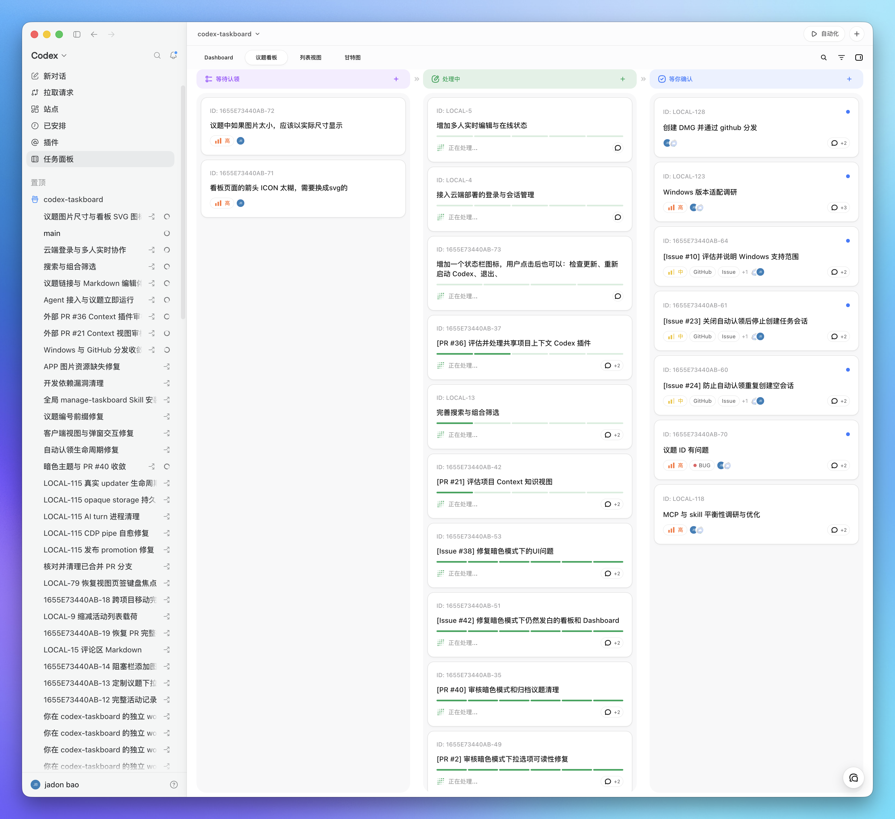

[English](README.md) | [简体中文](README.zh-CN.md)

# Codex Taskboard

A local-first issue board that runs in a browser and can be embedded in Codex through the standalone CDP launcher or its injection script. The same HTTP API powers the React UI and the `taskctl` CLI used by the bundled Codex Skill.



## Requirements

- Node.js 22.5 or newer
- macOS App and DMG builds: Xcode Command Line Tools and Rust 1.88 or newer with the `aarch64-apple-darwin` and `x86_64-apple-darwin` targets. `npm install` installs the Tauri CLI used by this project.
- Windows NSIS builds: the Microsoft Store Codex App, Rust 1.88 or newer, and Visual Studio Build Tools with the C++ workload and Windows SDK.

## Run locally

```bash
npm install
npm run build
npm start
```

Open <http://127.0.0.1:47823>. The SQLite database is stored at `.data/taskboard.sqlite`.

For development with live frontend reload:

```bash
npm run dev
```

The Vite UI runs at <http://127.0.0.1:5173> and proxies API requests to the local service.

## Use the CLI

Run it from the project:

```bash
npm run taskctl -- project create \
  --id my-project \
  --name "My project" \
  --workspace-path /absolute/path/to/repository

npm run taskctl -- issue create \
  --project my-project \
  --title "Implement the next slice" \
  --status todo \
  --priority high \
  --labels product,mvp
```

Use `npm link` if you want `taskctl` on your shell path. Set `CODEX_TASKBOARD_URL` to point the CLI at another local or LAN service. Cloud deployments are configured through the **loopback companion** (device-local loopback service for auth and path mapping—not a chat persona) with `taskctl cloud login`.

## Install the Codex Skill

Copy or symlink `skills/manage-taskboard` into the Codex skills directory, then start a new Codex task:

```bash
ln -s /absolute/path/to/codex-taskboard/skills/manage-taskboard \
  ~/.agents/skills/manage-taskboard
```

The desktop app keeps this same directory synchronized with its bundled Skill. The Skill teaches Codex to inspect an issue, move it to `in_progress`, use optimistic versions, verify the work, and then move it to `in_review`; it moves the issue to `done` only after the user explicitly confirms acceptance or asks to mark it complete.

## Embed in Codex

### Manual: use a dedicated CDP port

Keep the existing Codex window open. From the Taskboard repository, start a second Codex instance with a dedicated CDP port:

```bash
open -n -a /Applications/ChatGPT.app --args \
  --remote-debugging-port=9231 \
  --remote-allow-origins=http://127.0.0.1:9231
```

After the new Codex window appears, run the injector in another terminal:

```bash
CODEX_TASKBOARD_HOST=127.0.0.1 \
npm run codex:inject -- --port 9231 --open
```

Keep the injector terminal running while using the embedded panel. The original Codex window remains unchanged, and the new window receives the Taskboard sidebar entry. If port `9231` is occupied, use another port in both commands.

### Recommended: launch an independent Taskboard window with one command

Keep existing Codex windows open and run:

```bash
CODEX_TASKBOARD_HOST=127.0.0.1 npm run codex
```

This starts the local Taskboard service when needed. It reuses an open Codex with a reachable CDP renderer, opens Taskboard in the native browser panel of an ordinary Codex without CDP, or launches the official macOS Codex app with an independent profile and loopback-only port `9231` when no Codex is open. It injects a native-looking Taskboard entry after Plugins when CDP is available and keeps watching both the service and replacement renderers. Keep this command running while using the embedded panel. The launcher does not modify `ChatGPT.app` or its `app.asar`.

The source launcher writes its authenticated endpoint to `.data/launcher-runtime.json`. A `taskctl` command installed with `npm link` reads this file by default, so a normal shell and a Codex task opened from the panel use the same Taskboard service without an extra environment variable.

### macOS App: open and inject without a terminal

For Tauri development, run:

```bash
npm run app:dev
```

To build the local App and DMG, install the two Rust targets once, then run the build:

```bash
rustup target add aarch64-apple-darwin x86_64-apple-darwin
npm run app:build
```

Open `src-tauri/target/universal-apple-darwin/release/bundle/macos/Codex Taskboard.app` from Finder. The DMG is in `src-tauri/target/universal-apple-darwin/release/bundle/dmg/`. If you only want the stable App, download the current DMG from [GitHub Releases](https://github.com/chuspeeism/dashi-taskboard/releases/latest).

The App contains its own Node runtime, Taskboard service, built web UI, Skill, CLI wrapper, and injection script. It starts the service, reuses an open Codex with a reachable CDP renderer, opens Taskboard in the native browser panel of an ordinary Codex without CDP, or launches the official Codex app when no Codex is open. It waits for the renderer, injects the sidebar entry when CDP is available, and opens the panel without showing a terminal window. The App can be copied away from this checkout; the target Mac only needs the official Codex app and does not need this repository, a system Node installation, or a separate Codex CLI installation. Taskboard data is stored in `~/Library/Application Support/Codex Taskboard`, and launcher output is written to `~/Library/Logs/Codex Taskboard/codex-taskboard-launcher.log`.

### Linux App: Ubuntu 24.04 x64 packages

The first Linux desktop release supports Ubuntu 24.04 LTS on x64 only. Install the official ChatGPT desktop `.deb` first and confirm that `chatgpt` opens it. Then download either the Codex Taskboard `.deb` or `.AppImage` from [GitHub Releases](https://github.com/chuspeeism/dashi-taskboard/releases/latest). Replace `<file>` below with the downloaded filename.

Install the `.deb` package:

```bash
sudo apt install ./<file>.deb
```

Or run the AppImage:

```bash
chmod +x ./<file>.AppImage
./<file>.AppImage
```

To build both packages on Ubuntu 24.04 x64, run:

```bash
npm ci
npm run app:build:linux:x64
```

This first release does not support ARM64, Fedora, RPM packages, or other Linux distributions.

### Windows code signing

For official Windows releases after the application is approved: **Free code signing provided by [SignPath.io](https://signpath.io/), certificate by [SignPath Foundation](https://signpath.org/).** Current Windows CI artifacts remain unsigned until that approval. See the [Code signing policy](docs/code-signing-policy.md), [Privacy policy](PRIVACY.md), and [Windows uninstall instructions](docs/windows-uninstall.md).

The local build uses ad-hoc code signing for direct verification. A public macOS download still needs Developer ID signing and Apple notarization.

### Windows App: tray launcher and bundled Taskboard

Install the official Codex App from the Microsoft Store. To build the current-user NSIS installer on Windows x64, run:

```powershell
npm ci
npm run app:build:windows
```

The installer is written to `src-tauri/target/x86_64-pc-windows-msvc/release/bundle/nsis/`. It installs a tray launcher, bundled Node runtime, local service, built web UI, Skill, `taskctl.cmd`, and injection script. Taskboard data is stored in `%APPDATA%\Codex Taskboard`; logs are stored in `%LOCALAPPDATA%\Codex Taskboard\Logs`; the Skill is copied to `%USERPROFILE%\.agents\skills\manage-taskboard`.

Windows CI artifacts are intentionally unsigned and do not auto-update. Review [the code-signing policy](docs/code-signing-policy.md) before distributing a build. See [Windows uninstall](docs/windows-uninstall.md) for retained-data behavior.

Codex 26.715.52143 ships a renderer CSP that blocks arbitrary HTTP iframes. The launcher therefore enables CDP CSP bypass, reloads that renderer once, installs the document-start script, and waits until the Taskboard OOPIF is actually loaded. CDP is unauthenticated to other processes on the same machine, so only run trusted local code while the launcher is active.

To inject into a Codex instance that was already launched with CDP by another method, run:

```bash
npm run codex:inject -- --port 9229 --open
```

This command also stays resident so the injected tab can restart Taskboard after a service exit. Stop it with `Ctrl-C`.

The script adds a Taskboard entry to the Codex sidebar and renders the iframe across Codex's complete main workspace, including the contextual titlebar area so Taskboard's own header does not leave an empty strip. That full rectangular header is placed above Electron's draggable layer and marked `no-drag`; because the native contextual actions are suppressed while Taskboard is active, its own actions use their normal edge padding without an artificial right-side gap. The native sidebar stays mounted, while the previous page selection and contextual header are temporarily suppressed; choosing another Codex page restores them.

“在对话中打开” selects the corresponding native Codex project when one is available and opens an unsent native composer with an `e-taskboard` instruction and the issue's actual identifier. The installed Skill is selected implicitly from that instruction, so the composer does not add a `$manage-taskboard` mention. A conversation is attributed only after it actually processes the issue: `taskctl` reads Codex's `CODEX_THREAD_ID` and records that ID on the issue or comment mutation. Recorded IDs are clickable through Codex's native route bridge. Each issue can bind either one Git branch or one worktree; the options are scanned from the selected Codex project's repository instead of being typed by hand. The integration uses Codex's existing project, composer, and route markers; it does not patch React, replace `fetch`, load private chunks, or edit Codex data files.

To use a different UI origin, set `window.__CODEX_TASKBOARD_URL__` before the user script runs.

## Feishu Auto-Cut integration

The Feishu Bridge and Taskboard integration is local-only. The Bridge creates workflow tasks through `POST /api/local/feishu/tasks` with the `x-taskboard-client: feishu-bridge` header and the per-launch `x-feishu-bridge-secret` shared secret. `start-local.ps1` injects the same `CODEX_FEISHU_BRIDGE_SECRET` into both services. That route stores a server-owned Base/table/record provenance row alongside the task. A normal `POST /api/tasks` request that merely copies the Feishu description marker or the `feishu` label is not eligible to start Auto-Cut, upload artifacts, or appear in the Bridge waiting-task query.

A server-registered Feishu task may run its locally registered Auto-Cut package from a non-Git workspace. Taskboard supplies Codex's non-Git workspace option only after resolving the server-owned task provenance and trusted package snapshot; ordinary tasks, copied markers, browser input, and Feishu cells cannot request it.

If Codex exits before returning a native thread ID, moving the trusted task back to `todo` and starting it again detaches the failed local conversation while preserving that conversation in history. A task whose native Codex thread already started is never detached automatically, which prevents an accidental duplicate Auto-Cut run.

The Bridge uses these loopback routes for lifecycle reconciliation:

- `GET /api/local/feishu/tasks` — query trusted tasks by event or Base/table/record/trigger scope.
- `POST /api/local/feishu/tasks/:id/archive` — archive only a trusted task after an optimistic version check.
- `POST /api/local/tasks/:id/execute` — the single execution claim path used by manual start and drag-to-`in_progress`. Repeated requests for the same task and trigger reuse the existing reservation; a different trigger remains protected by the start-in-progress conflict.

Each Base/table subject has a deterministic isolated project id: `feishu-` plus the first 16 hexadecimal characters of `sha256(baseToken:tableId)`. The Bridge and Taskboard must use this same rule; existing legacy project ids are not rewritten automatically, and newly delivered tasks use the 16-character form.

Use the workflow panel to paste either a direct Feishu `/base/{base_token}` link or a knowledge-base `/wiki/{wiki_token}` link from an official `https://*.feishu.cn` domain. Taskboard passes the complete link to the loopback Bridge for read-only metadata. For Wiki links, the Bridge first confirms that the node is a bitable and resolves its real Base token while preserving the optional `table` selection; the Wiki token is never treated as a Base identity. Every discovered table remains a draft until it is explicitly shown and enabled, and display visibility remains independent from Bridge enablement. `/base/workspace/{token}` links are still unsupported. Wiki imports require the Feishu application used by the Bridge to have read access to the Wiki node.

Each subject draft selects one Base single-select status field and uses that field's current options to configure the three fixed stages: initial cut, first-review revision, and final-review revision. Every stage has its own enable switch, trigger option, video source, review source, audio mode, ZIP destination, and name suffix; at least one stage must remain enabled. Only an edge from another option into that stage's configured option registers a task. A disabled stage does not backfill missed work, and every registered task keeps an immutable copy of its stage and subject configuration.

A stage source is either one Base attachment field or a section in the single Feishu document link held by the configured document field. That link may be a direct `/docx/` URL or a `/wiki/` document URL. Document section anchors match trimmed heading text exactly and include nested content until the next heading at the same or higher level. Attachments retain source order and original filenames; multiple videos and replacement audios pair in document order, while a Base attachment source currently requires exactly one matching file. Missing headings, empty ranges, unreadable documents, download failures, count mismatches, or unreasonable duration differences block the run instead of guessing. `video_original` keeps each video's own audio; `replace_original` requires an explicit audio source and delegates muting/alignment to Auto-Cut Lite.

Each subject also stores manual or automatic execution mode, one fixed package alias, concurrency limits, upload policy, one naming field, and stage-specific ZIP destinations. The naming field may be plain text or a computed text result; Taskboard appends the frozen stage suffix and applies Auto-Cut Lite's Windows-safe 180-character name normalization before creating the run paths. Enabled stages in automatic mode require their own absolute local/UNC destination. Enabling performs live metadata and local package validation before replacing the active Bridge snapshot. Exported shared configuration omits credentials, workspace paths, ZIP source paths, upload paths, runtime state, and task history. Import first shows live Bridge plus local binding diagnostics, lists the actual warning/error messages for confirmation, and always writes subjects as drafts.
Refreshing metadata for an already-enabled subject creates a new local draft and leaves the last validated Bridge snapshot active until that draft is explicitly enabled.

Automatic execution is an explicit server policy (`allowAutomaticExecution`) and remains off unless the local deployment enables it with `CODEX_TASKBOARD_ALLOW_AUTOMATIC_EXECUTION`. A successful Auto-Cut run remains `in_progress` until its Jianying ZIP is validated and SHA-256 hashed; that verified ZIP moves manual tasks to `in_review` and automatic tasks to `done`. Automatic upload configuration queues automatic tasks after ZIP verification and queues manual tasks after acceptance moves them to `done`; manual upload configuration leaves enqueueing to the completed-task UI. Upload jobs copy the verified artifact to a configured local or UNC/NAS destination with per-subject concurrency, manual retry, and conflict protection.

The workflow panel supports `manual_select` and `driver_report`; `watch_directory` remains reserved and disabled. For `driver_report`, configure an absolute ZIP source root. On the existing Codex path, Auto-Cut calls `taskctl artifact report --file <absolute accepted ZIP>` after validating the exact ZIP produced by its current run. For an authorized phased retry, Taskboard instead starts the registered local Auto-Cut runtime with the run-owned manifest, result-receipt, and expected ZIP paths; after it exits, Taskboard hashes only that exact ZIP and submits the same run-scoped artifact report internally.

When a blocked phased Feishu Auto-Cut run needs the two external-operation approvals, send `POST /api/local/tasks/:id/autocut-retry` with the current optimistic version (replace the example `16`) and the closed consent object:

```json
{
  "version": 16,
  "runConsent": {
    "allowVideoAudioAsr": true,
    "allowConfiguredLocalOutput": true
  }
}
```

`runConsent` is optional; omitting it preserves the existing retry behavior. When present, both fields must be literal `true` booleans and no other fields are accepted. Only a retry carrying both consent fields for a server-registered, blocked, phased Feishu Auto-Cut task is routed to Taskboard's local Auto-Cut runner; that retry does not start another Codex turn. Initial execution and consent-free retries retain the existing Codex path, while ordinary tasks, copied description markers, and legacy or unregistered tasks are rejected and cannot obtain local execution capability. The approval is held only in memory from retry scheduling through creation of that one run. The raw request/object is not persisted, inherited, copied into package prompts or ordinary user messages, or placed in environment variables; authorization is never taken from comments, Feishu cells, paths, or free text. The local runtime receives only the server-owned run paths and binding, may send video audio only to `openspeech.bytedance.com` for word-level timing and acceptance, and may write the Jianying draft/ZIP only to the configured `CODEX_AUTOCUT_DRAFTS_ROOT` and `CODEX_AUTOCUT_PACKAGE_ZIP_PATH` locations. Taskboard still uses the exact run-bound `driver_report` ZIP, never scans a directory or guesses the newest file, and does not write status or results back to Feishu. If the service restarts before run creation, the in-memory approval is lost and the task must be authorized again.

Taskboard accepts a driver report only from the active run of a server-registered trusted Feishu task. A phased run must write its terminal result to the exact server-owned result path and its package receipt to the exact adjacent `<ZIP>.receipt.json` path. Taskboard cross-checks both receipts against the immutable task/run/subject/config/stage/event binding, source-manifest digest, frozen draft name and ZIP path, archive SHA-256, CRC/tree validation flags, its own ZIP hash, and the parsed Jianying draft root before storing the artifact and marking the run reported in one transaction. It never scans the source directory, chooses a newest ZIP, or infers task ownership from a filename. Reporting leaves the task `in_progress` until that same run succeeds; automatic execution then moves to `done` and, when `enqueueMode=automatic`, enqueues that exact artifact to the frozen stage destination. Manual execution moves to `in_review` and retains its existing acceptance flow. Blocked phased runs remain visible as immutable attempts and can be retried explicitly; a retry creates a new attempt instead of rewriting the prior run.

Phased subjects use one configured Base single-select status field and three fixed stage IDs: `initial`, `first_review`, and `final_review`. Each stage has its own enabled switch, actual option ID, video source, review anchor, sound mode, name suffix, and local/NAS artifact destination; at least one stage must remain enabled. A task is created only for a real transition from another option into that enabled stage's configured option. Disabled stages are not backfilled, and later subject edits do not change the immutable configuration snapshot already attached to a task and run.

The shared document field must resolve to one Feishu Docx link, and the naming field must provide one non-empty, unique text or computed-text result. A stage may read video from an exact-trimmed Docx anchor range or one Base attachment. Review instructions come only from that stage's configured Docx anchor. `video_original` keeps the source sound; `replace_original` requires an independent Docx or Base audio source and uses a positive duration tolerance of 3 seconds by default. Multiple Docx videos and replacement audios are paired only by their top-to-bottom document order; missing or ambiguous anchors, empty ranges, count mismatches, non-unique Base attachments, download failures, or unreasonable durations block the run instead of invoking filename or duration guesses.

For a phased run, Taskboard writes one canonical source manifest and one naming input under a task/run-private directory. It injects their paths, the manifest SHA-256, the complete task/run/stage/config/event binding, the exact result-receipt path, and the exact expected ZIP path into Auto-Cut. Auto-Cut reads Feishu material with its locally authorized user identity and returns a terminal receipt for that run. Taskboard requires the receipt, report, ZIP bytes, hash, expected draft name, frozen package snapshot, and immutable binding to agree before accepting the artifact. Editing stays serialized at one run per Auto-Cut package while upload copying keeps its separate configured concurrency.

Source or validation failures leave the task `blocked` with the retained run ID and stable reason. After correcting the Feishu source, use `Retry Auto-Cut` in the task detail view. Retry creates a new attempt, refreshes only the current controlled document/naming values against the same immutable subject version, and preserves every earlier run and artifact record. Taskboard and the Bridge remain bound to `127.0.0.1`, do not write status or results back to Feishu, and never interpret Base cells as local paths, commands, prompts, credentials, package aliases, or upload destinations.

### Unified Feishu subject workflow board

For a Feishu subject, the Base and subject selected in the sidebar are the only scope of the workflow board. Tasks, saved views, stage names, and descriptions from another Base or subject never enter the current page. On first entry, Taskboard creates only the protected `All stages` system view, which lists the available stages in their stable order. It cannot be edited or deleted, and Taskboard does not pre-create business views such as an editing or upload view.

To make a board for a particular workflow, choose `New view`, enter a name, select the required stages, arrange their order, and choose `Save`. You can then select that view from the workflow board and use `Manage views` to copy, edit, make default, or delete a custom view. Views and filters change only the current subject's display; they do not change a task's actual status or affect another subject. In that subject's stage-display settings, stage names and descriptions can be changed to explain when cards appear. Those labels are descriptive only: they do not change Auto-Cut, review, or upload execution rules.

Hidden stages do not lose work. The board keeps counts for tasks, verified ZIPs, and failed uploads in hidden stages. To find a hidden task, set `Search scope` to `All stages`; a result can temporarily reveal its stage without changing the saved view. ZIP details are folded by default and can be opened with a pointer or keyboard; failed-upload details open automatically so their retry state is visible. Upload columns are read-only, so dragging cannot change upload state; enqueue, the upload worker, and retry actions continue to drive those states. Ordinary tasks remain under the `Other tasks` tab instead of being mixed into the subject workflow.

Ordinary local projects keep their `node mode`; Feishu subjects use the unified workflow board and do not show the node-mode entry. From the project menu, archiving moves a local project to `Archived / history`, where it can be restored. Only an empty manually-created project can be deleted permanently, and that deletion cannot be undone. Removing a Base or subject from Taskboard archives its local history and workflow views only; it does not delete the remote Feishu Base, table, or records. Re-adding the same subject restores its local history.

Base cells provide only controlled values and package aliases. They never provide a workspace path, shell command, prompt, credential, or upload destination; those bindings stay in the local Taskboard/Bridge configuration.

## Configuration

| Variable | Default | Purpose |
| --- | --- | --- |
| `CODEX_TASKBOARD_HOST` | `127.0.0.1` | HTTP bind address; only loopback is allowed |
| `CODEX_TASKBOARD_PORT` | `47823` | Local HTTP port |
| `CODEX_TASKBOARD_TRUSTED_ORIGINS` | unset | Comma-separated exact HTTPS origins allowed through a loopback reverse tunnel |
| `CODEX_TASKBOARD_DATA_DIR` | `.data` | SQLite data directory |
| `CODEX_TASKBOARD_URL` | `http://127.0.0.1:47823` | CLI API origin |
| `CODEX_TASKBOARD_ALLOW_AUTOMATIC_EXECUTION` | unset (off) | Set to `1`, `true`, `yes`, or `on` only on an explicitly approved local deployment |

`npm start` exposes the taskboard only on the local machine. Task, comment, and attachment changes are broadcast to every open local client through server-sent events; reconnecting clients perform a full refresh so changes made while disconnected are not missed.

For a reverse tunnel that connects to the local listener, set `CODEX_TASKBOARD_TRUSTED_ORIGINS` to the tunnel's public HTTPS origin, for example `https://board.example.test`. Multiple origins are comma-separated. The variable cannot be empty, and duplicate origins (including normalized forms such as a trailing slash or default HTTPS port) are rejected at startup. Entries must otherwise be exact HTTPS origins; paths, queries, fragments, credentials, and wildcards are rejected. A reverse proxy or tunnel can preserve that public `Host`: Taskboard derives its canonical HTTPS origin and requires an exact configured match. If the browser supplies an `Origin`, that header is validated independently; the proxy must preserve it rather than fabricate one. Forwarded headers are not used for either decision. Configured public hosts and trusted origins can use ordinary Taskboard HTTP and realtime endpoints, but device-local capability routes remain unavailable even though the tunnel socket is loopback. Requests using only direct local or private-LAN hosts and origins keep their existing behavior.

## Share through Cloudflare

For two trusted collaborators, the taskboard can run on Cloudflare with Worker Static Assets and API routes, D1 as the authoritative business database, and a private R2 bucket for attachments. The deployment uses HTTPS Basic Authentication with a shared password and refreshes open boards after a global revision changes.

Each device keeps its own project checkout mapping and continues to use a local companion for Codex, Git/worktree, Skill, and MCP capabilities. Cloud mode never falls back to or double-writes the local SQLite database.

See [Cloud collaboration](docs/cloud-collaboration.md) for owner deployment, existing GitHub installation setup, password rotation, local path mapping, and the one-time local-data migration flow.

## License and source

This standalone distribution is published at [fengcong22/feishu-autocut-taskboard](https://github.com/fengcong22/feishu-autocut-taskboard). It is based on the upstream [chuspeeism/dashi-taskboard](https://github.com/chuspeeism/dashi-taskboard) project; the current Feishu Auto-Cut feature version is maintained in this independent repository.

Unless a file or a third-party notice says otherwise, project contributions in this repository are licensed under the [Apache License 2.0](LICENSE). See [NOTICE.md](NOTICE.md) for the source history, third-party materials, and the scope of the repository-level license. Third-party product names and logos remain subject to their respective owners' terms.

## Verify

```bash
npm run check
```

This runs TypeScript checking, a production frontend build, the component tests, and the server/CLI/injection test suite.

## Task Markdown

Task descriptions and comments support GFM, including tables and task lists. Fenced `mermaid` blocks are rendered as read-only diagrams after the viewer loads; the diagram source remains available when rendering fails. Markdown HTML comments, such as `<!-- trace-analysis:v1 ... -->`, are hidden from the rendered document. Raw HTML is not enabled.
